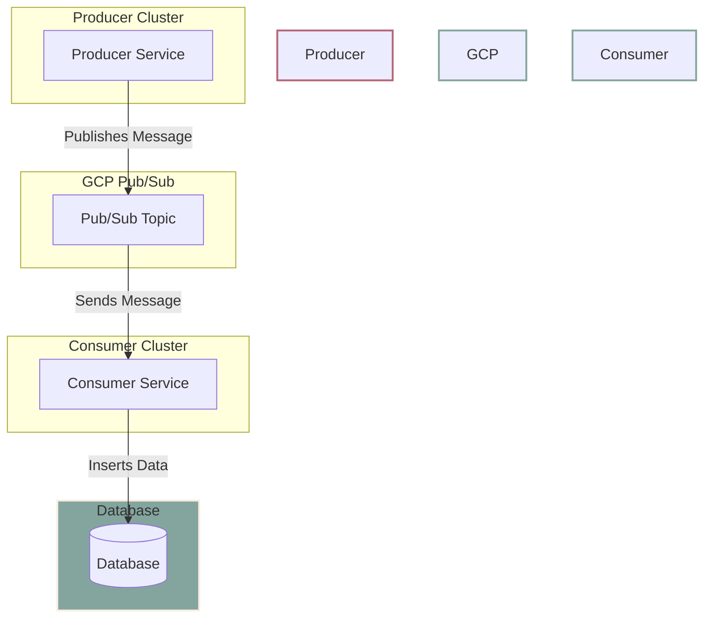

# Cloud Pub/Sub Integration

This repository contains a project that demonstrates the integration of Google Cloud Pub/Sub with a Kubernetes environment on Google Kubernetes Engine (GKE). The project includes both a producer service and a consumer service, illustrating a complete message-passing pipeline from publishing to processing.

## Overview

- **Producer Service**: A Python application that publishes messages to a Pub/Sub topic. The producer is containerized using Docker and deployed to a GKE cluster.
  
- **Consumer Service**: A Python application that subscribes to the Pub/Sub topic, receives messages, and stores them in a PostgreSQL database. The consumer is also containerized and deployed to a GKE cluster.

## Architecture



## Setup and Deployment

1. **Create GKE Clusters**: Set up a GKE cluster for the producer service.

   ```sh
   gcloud container clusters create producer-cluster --num-nodes=3 --region=us-central1
   ```

2. **Create Pub/Sub Topic and Subscription**: 

   ```sh
   gcloud pubsub topics create my-topic
   gcloud pubsub subscriptions create my-subscription --topic=my-topic
   ```

3. **Deploy Producer Service**:

   - Create a Docker image for the producer and push it to Google Container Registry.
   - Deploy the producer service to the GKE cluster using the provided Kubernetes deployment files.

4. **Deploy Consumer Service**:

   - Create a Docker image for the consumer and push it to Google Container Registry.
   - Deploy the consumer service to the existing GKE cluster using the provided Kubernetes deployment files.

## Technologies Used

- Google Cloud Platform (GCP)
- Google Kubernetes Engine (GKE)
- Google Cloud Pub/Sub
- Docker
- Python
- PostgreSQL

## Prerequisites

- Google Cloud SDK installed and configured
- Access to a Google Cloud Project
- Kubernetes CLI (kubectl) installed

## Getting Started

To get started with this project, clone the repository and follow the instructions in the `setup.md` file for detailed steps on deploying the services and running the application.
      
